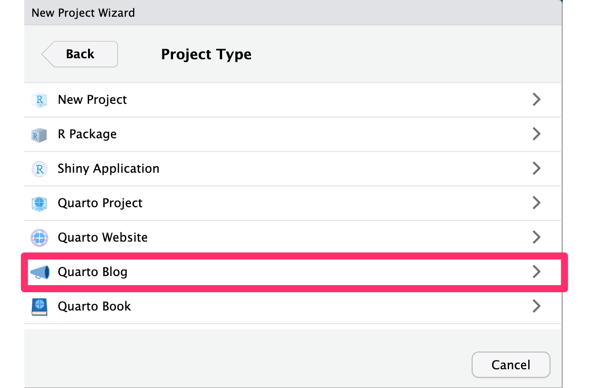
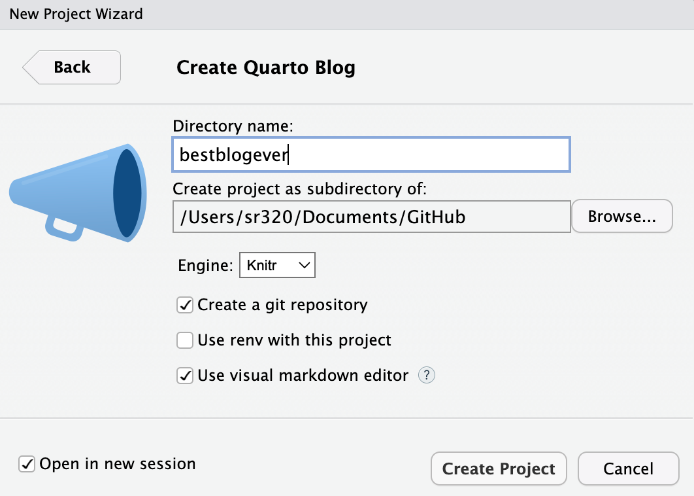
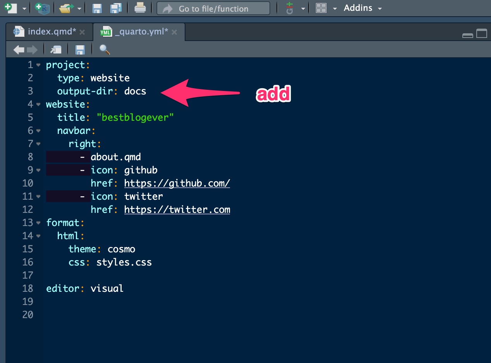
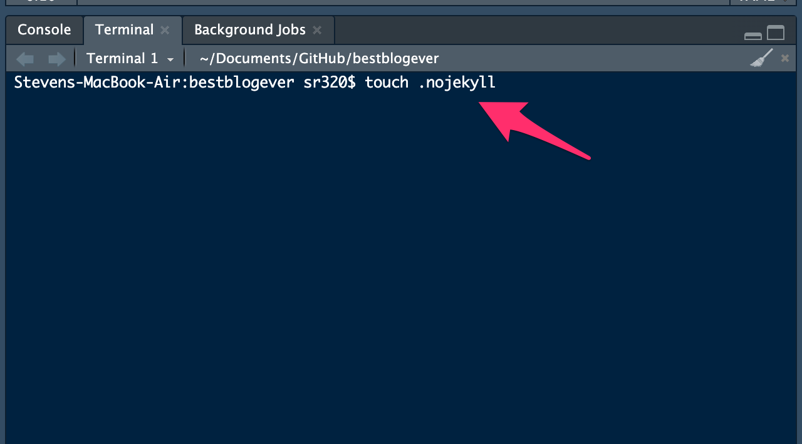
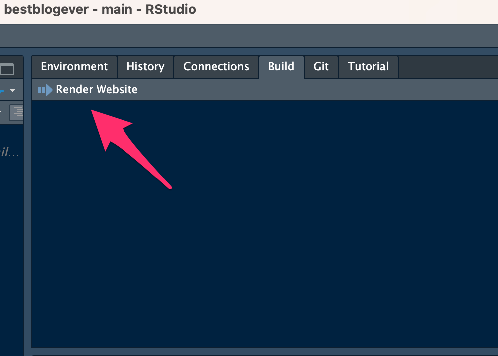

```{r set_defaults, include=FALSE}
knitr::opts_chunk$set(echo = TRUE)
```

------------------------------------------------------------------------

# Background

One of the great features of Quarto is using it to create websites. What is really cool is the ability to used code chunks you might be already be familiar with. Unique features include callouts and tabs. These websites can be quite simple with only a single page, a blog, or more complex with multiple pages and options, such as the website for this course. Websites created with **Quarto** can be viewed/hosted directly on **GitHub**, or copied over to a server such as <http://students.washington.edu>.

------------------------------------------------------------------------

# Setup

For this exercise, we'll create a simple personal blog and host it on **GitHub**. See also <https://quarto.org/docs/websites/website-blog.html>

## Create RStudio project

Create a new project in **RStudio**. However, rather than base this new project on an existing repo, as we've done in the past, we'll instead choose **New Directory**.

```{r rs_new_proj, echo = FALSE, out.width = "70%", fig.align = "center"}
knitr::include_graphics("img/rs_new_project.png")
```

<br>

Scroll down the options for **Project Type** and select Quarto Blog.

```{r rs_blog, echo = FALSE, out.width = "70%", fig.align = "center"}

```

<br>

In the next window, enter your a name for `Directory name:`

Choose the location where you'd like this new project to live.

When you are finished, check the box next to `Open in new session` and click the **Create Project** button.

```{r rs_dir, echo = FALSE, out.width = "70%", fig.align = "center"}

```

<br>

# Prepare for GitHub Publishing

## Render to `docs`

```{r rs_docs, echo = FALSE, out.width = "70%", fig.align = "center"}

```

You could also change the theme, blog title, links, etc here.

## add a `.nojekyll` file

```{r rs_no, echo = FALSE, out.width = "70%", fig.align = "center"}

```

## Render

```{r rs_render, echo = FALSE, out.width = "70%", fig.align = "center"}

```

## Commit and Push

First time needs to be done via command line or GitHub Desktop, then could be done all within RStudio.

```{r gh_desktop, echo = FALSE, out.width = "70%", fig.align = "center"}
knitr::include_graphics("img/gh_desktop.gif")
```

<br>

------------------------------------------------------------------------

# Publish with GitHub Pages

Now we can go to the repo in GitHub and set source for deployment.

```{r pages, echo = FALSE, out.width = "70%", fig.align = "center"}
knitr::include_graphics("img/gh_pages.gif")
```

```{r live, echo = FALSE, out.width = "70%", fig.align = "center"}
knitr::include_graphics("img/gh_live.gif")
```

Everthing should be live. 

<br>

------------------------------------------------------------------------

# Creating a new post


